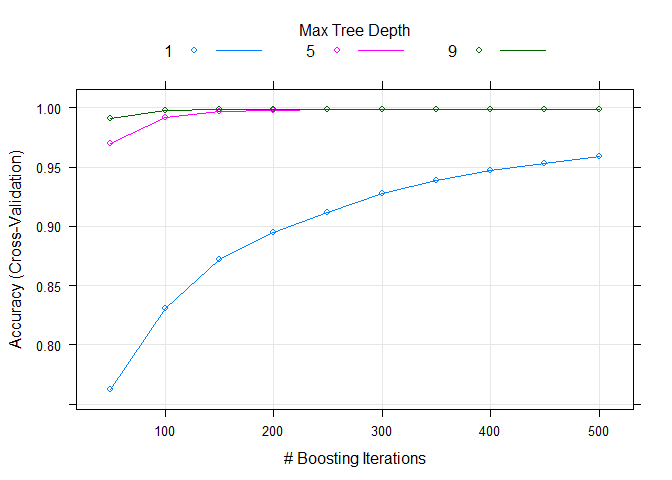

# Human Activity Recognition - Practical Machine Learning Course Project
Calin Uioreanu  
October 16, 2015  

Human Activity Recognition - HAR - has emerged as a key research area in the last years and is gaining increasing attention for applications of machine learning, supervised and unsupervised. For more informations, please visit: <http://groupware.les.inf.puc-rio.br/har>

We will use the [caret R Package](http://topepo.github.io/caret/index.html) for its ease of use and the unified interface to a large number of modeling and prediction models. To estimate model performance we will use the accuracy, in case of multiclassifications problem the most significant outcome. Similar model performance indicators are AUC, the area under the Receiver Operating Characteristic (ROC) curve, used to estimate performance using a combination of sensitivity and specificity.


# Libs & Preps

```r
#rm(list=ls()); gc()
suppressWarnings(suppressMessages(library(caret)))
# some other libraries are required as well: gbm, plot3D, randomForest, lattice and several subdependecies
```


# Retrieving data from HAR

```r
dataUrl = 'https://d396qusza40orc.cloudfront.net/predmachlearn/pml-training.csv';
testUrl = 'https://d396qusza40orc.cloudfront.net/predmachlearn/pml-testing.csv';
dataSet = read.csv(dataUrl, na.strings=c("NA",""))
testSet = read.csv(testUrl,na.strings=c("NA",""))

# a large object, candidate for data.table?
print(object.size(dataSet), units="Mb")
```

```
## 19 Mb
```


# Basic exploration procedures

```r
# 19622 rows x 160 predictors data.frame; 20 rows x 160 final testing set
dim(dataSet); dim(testSet)
```

```
## [1] 19622   160
```

```
## [1]  20 160
```

```r
# which variable is in the Training Set and not in the Testing Set, respective the reverse (in the Testing Set, not in the Training Set)
setdiff(names(dataSet), names(testSet)); setdiff(names(testSet), names(dataSet))
```

```
## [1] "classe"
```

```
## [1] "problem_id"
```

```r
# 20 - very few test-cases.
nrow(testSet)/nrow(dataSet)
```

```
## [1] 0.001019264
```

```r
# outcome variable spread
table(dataSet$classe)
```

```
## 
##    A    B    C    D    E 
## 5580 3797 3422 3216 3607
```

```r
# Now some charts to get an idea of the data complexity

# plot cross-combinations of magnet_arm values by activity
plot(dataSet[,grep("^magnet_arm", names(dataSet))], 
     pch=20, 
     cex=0.8, 
     col=dataSet$classe, 
     main="Magnet Arm coloured by Activity")
```

 

```r
# in 3D, some beautiful patterns emerge
suppressWarnings(
plot3D::points3D(
  dataSet$magnet_arm_x, 
  dataSet$magnet_arm_y, 
  dataSet$magnet_arm_z, 
  col=dataSet$classe,
  main="3D Magnet Arm by Activity",
  pch=20, cex=0.8
))
```

 

```r
# 3D Magnet dumbbell
suppressWarnings(
plot3D::points3D(
  dataSet$magnet_dumbbell_x, 
  dataSet$magnet_dumbbell_y, 
  dataSet$magnet_dumbbell_z, 
  col=dataSet$classe,
  theta=0,
  main="3D Magnet dumbbell by Activity",
  pch=20, cex=0.8
))
```

 

```r
# ... way more data to explore and plot, a true project on its own.
# chartGroupPatterns = c('magnet_belt', 'magnet_arm', 'magnet_dumbbell', 'magnet_forearm' ), group charts and so on
```


# Pre–Processing the Data : cleanup procedures
A large number of predictor variables lead to complicated models, our goal is to prevent that but the same time avoid over-simplification. We will remove variables that have more than 30% NAs, investigate the use of imputation for the remaining ones. We will ignore autoincrement IDs & timestamps.

```r
# create the threshold
thresholdNAs <- round(nrow(dataSet)*0.3)

# keep only the predictor variables that have less than 30% NAs
dataSet <- dataSet[, colSums(is.na(dataSet))< thresholdNAs]

# this actually got rid of all NAs, no imputation needed
sum(colSums(is.na(dataSet)))
```

```
## [1] 0
```

```r
# remove timestamps & autoincrement IDs
dataSet <- dataSet[,6:ncol(dataSet)]

# 55 predictors left
dim(dataSet)
```

```
## [1] 19622    55
```

```r
# only numeric and integer variables left + 2 remaining factor variables: "new_window"" and the outcome variable "classe"
table(sapply(dataSet, class))
```

```
## 
##  factor integer numeric 
##       2      26      27
```

```r
# look at "new_window" closer
prop.table(table(dataSet$new_window, dataSet$classe),1)
```

```
##      
##               A         B         C         D         E
##   no  0.2847107 0.1934846 0.1744380 0.1637698 0.1835970
##   yes 0.2684729 0.1945813 0.1724138 0.1699507 0.1945813
```

```r
# new_window looks irelevant, dropping
dataSet$new_window<-NULL
```


# Train/test split
We use caret's createDataPartition() to conduct data splits within groups of the data (stratified sampling). The final model will be used just once on the generated 30% testing set to prevent overfitting. Same goes for the final 20 testSet cases.

```r
set.seed(2015)
inTrain <- createDataPartition(y=dataSet$classe,
                              p=0.70, list=FALSE)
training <- dataSet[inTrain,]
testing <- dataSet[-inTrain,]
```


# Pre–Processing the Data: Standardizing - centering and scaling numeric predictors

```r
#* centering and scaling variables except for the factor outcome
preObj <- preProcess(training[, -ncol(training)],method=c("center","scale"))
trainVARS <- predict(preObj, training[, -ncol(training)])
# mean=0 
round(sum(sapply(trainVARS, mean)),8)
```

```
## [1] 0
```

```r
# sd = 1
table(sapply(trainVARS, sd))
```

```
## 
##  1 
## 53
```


# Pre–Processing the Data: Covariates Creation using PCA
We're looking into "binding" correlated predictors together using Principal Component Analysis in order to simplify the dataset even further without losing relevance. Covariates creation is actually refered to as Feature engineering.

```r
# build correlation matrix
M = cor(training[, -ncol(training)])
diag(M) = 0
# add the actual correlation to the result set
cbind(which(M>0.8, arr.ind=T), round(M[which(M>0.8, arr.ind=T)],2))
```

```
##                  row col     
## yaw_belt           4   2 0.81
## total_accel_belt   5   2 0.98
## accel_belt_y      10   2 0.93
## roll_belt          2   4 0.81
## roll_belt          2   5 0.98
## accel_belt_y      10   5 0.93
## magnet_belt_x     12   9 0.89
## roll_belt          2  10 0.93
## total_accel_belt   5  10 0.93
## accel_belt_x       9  12 0.89
## magnet_arm_x      25  22 0.81
## accel_arm_x       22  25 0.81
## magnet_arm_z      27  26 0.81
## magnet_arm_y      26  27 0.81
## accel_dumbbell_x  35  29 0.80
## accel_dumbbell_z  37  30 0.85
## pitch_dumbbell    29  35 0.80
## yaw_dumbbell      30  37 0.85
```

```r
# highly correlated variables are magnet_arm_x and accel_arm_x (> 80% correlation)
plot(
      training$magnet_arm_x, 
      training$accel_arm_x, 
      col=training$classe, 
      pch=20, 
      cex=0.8, 
      main="Correlated Magnet and Accel predictor values (cor>0.8)"
)
```

 

```r
preProc <- preProcess( 
            training[, -ncol(training)] , 
            method="pca", 
            pcaComp=16
)
# so we could use the parameters of the preferred PC to "aggregate" variables without losing relevancy
round(preProc$rotation[,1],4)
```

```
##           num_window            roll_belt           pitch_belt 
##              -0.0198              -0.3286               0.0491 
##             yaw_belt     total_accel_belt         gyros_belt_x 
##              -0.2554              -0.3200               0.0415 
##         gyros_belt_y         gyros_belt_z         accel_belt_x 
##              -0.1524               0.1629              -0.0652 
##         accel_belt_y         accel_belt_z        magnet_belt_x 
##              -0.3153               0.3316              -0.0869 
##        magnet_belt_y        magnet_belt_z             roll_arm 
##               0.0923               0.0304               0.1020 
##            pitch_arm              yaw_arm      total_accel_arm 
##               0.0207               0.0743               0.1172 
##          gyros_arm_x          gyros_arm_y          gyros_arm_z 
##              -0.0239               0.0922              -0.1965 
##          accel_arm_x          accel_arm_y          accel_arm_z 
##              -0.1285               0.2912              -0.1183 
##         magnet_arm_x         magnet_arm_y         magnet_arm_z 
##              -0.0842               0.0575               0.0258 
##        roll_dumbbell       pitch_dumbbell         yaw_dumbbell 
##               0.0502              -0.0724              -0.0581 
## total_accel_dumbbell     gyros_dumbbell_x     gyros_dumbbell_y 
##               0.1304               0.0221              -0.0197 
##     gyros_dumbbell_z     accel_dumbbell_x     accel_dumbbell_y 
##              -0.0526              -0.1347               0.1312 
##     accel_dumbbell_z    magnet_dumbbell_x    magnet_dumbbell_y 
##              -0.0912              -0.1136               0.0953 
##    magnet_dumbbell_z         roll_forearm        pitch_forearm 
##               0.1676               0.0743              -0.1162 
##          yaw_forearm  total_accel_forearm      gyros_forearm_x 
##               0.1176              -0.0261              -0.1172 
##      gyros_forearm_y      gyros_forearm_z      accel_forearm_x 
##              -0.0185              -0.0255               0.2103 
##      accel_forearm_y      accel_forearm_z     magnet_forearm_x 
##               0.0107              -0.0444               0.1059 
##     magnet_forearm_y     magnet_forearm_z 
##               0.0104              -0.0626
```


# Model building
In terms of model selection for this multiclass classification problem, there are several choices: CART, randomForest, glm, GBM. We train two [multinomial gradient boosting machine](http://www.ncbi.nlm.nih.gov/pmc/articles/PMC3885826/) (GBM) models. GMB creates many weak learners with little predictive power, stacking the learners on top of each other get a very powerful model as we will see. The first model is using gbm default settings and 5-fold CV, the second one uses an alternate tuning grid for parameters. [Model Training and Parameter Tuning for caret and gbm](http://topepo.github.io/caret/training.html). We also use caret's model independent syntax to create a randomForest model as benchmark.

```r
# using 5-fold Cross-Validation
fitControl <- trainControl(method="cv",
                           number=5,
                           verboseIter=FALSE)
set.seed(2015)
gbmFit <- train(classe ~ ., data=training,
                method="gbm",
                trControl=fitControl,
                verbose=FALSE)
```

```
## Loading required package: gbm
## Loading required package: survival
```

```
## Warning: package 'survival' was built under R version 3.2.2
```

```
## 
## Attaching package: 'survival'
## 
## The following object is masked from 'package:caret':
## 
##     cluster
## 
## Loading required package: splines
## Loading required package: parallel
## Loaded gbm 2.1.1
## Loading required package: plyr
```

```r
# plot the profile, examine the relationship between the estimates of performance and the tuning parameters. 
plot(gbmFit)
```

 

```r
gbmFit
```

```
## Stochastic Gradient Boosting 
## 
## 13737 samples
##    53 predictor
##     5 classes: 'A', 'B', 'C', 'D', 'E' 
## 
## No pre-processing
## Resampling: Cross-Validated (5 fold) 
## Summary of sample sizes: 10988, 10989, 10990, 10991, 10990 
## Resampling results across tuning parameters:
## 
##   interaction.depth  n.trees  Accuracy   Kappa      Accuracy SD
##   1                   50      0.7618090  0.6979322  0.014509474
##   1                  100      0.8314764  0.7867031  0.002921711
##   1                  150      0.8716606  0.8375399  0.008185305
##   2                   50      0.8846917  0.8539368  0.005167990
##   2                  100      0.9411803  0.9255747  0.004679793
##   2                  150      0.9654948  0.9563422  0.003347979
##   3                   50      0.9327356  0.9148558  0.003390564
##   3                  100      0.9713181  0.9637149  0.002556355
##   3                  150      0.9851490  0.9812154  0.003562295
##   Kappa SD   
##   0.018323165
##   0.003679978
##   0.010361872
##   0.006581991
##   0.005902242
##   0.004228813
##   0.004288672
##   0.003234625
##   0.004504355
## 
## Tuning parameter 'shrinkage' was held constant at a value of 0.1
## 
## Tuning parameter 'n.minobsinnode' was held constant at a value of 10
## Accuracy was used to select the optimal model using  the largest value.
## The final values used for the model were n.trees = 150,
##  interaction.depth = 3, shrinkage = 0.1 and n.minobsinnode = 10.
```

```r
#Alternate Tuning Grids, varying largely the amount of trees
gbmGrid <-  expand.grid(interaction.depth = c(1, 5, 9),
                        n.trees = (1:10)*50,
                        shrinkage = 0.1,
                        n.minobsinnode = 20)
set.seed(2015)
gbmFit2 <- train(classe ~ ., data = training,
                 method = "gbm",
                 trControl = fitControl,
                 verbose = FALSE,
                 ## Now specify the exact models 
                 ## to evaluate:
                 tuneGrid = gbmGrid)
plot(gbmFit2)
```

 

```r
# as the trees number increases, so does the Accuracy and the Kappa GBM indicator.
gbmFit2
```

```
## Stochastic Gradient Boosting 
## 
## 13737 samples
##    53 predictor
##     5 classes: 'A', 'B', 'C', 'D', 'E' 
## 
## No pre-processing
## Resampling: Cross-Validated (5 fold) 
## Summary of sample sizes: 10988, 10989, 10990, 10991, 10990 
## Resampling results across tuning parameters:
## 
##   interaction.depth  n.trees  Accuracy   Kappa      Accuracy SD 
##   1                   50      0.7621744  0.6983984  0.0107401590
##   1                  100      0.8306754  0.7856991  0.0060192446
##   1                  150      0.8722427  0.8382968  0.0039195011
##   1                  200      0.8951002  0.8672370  0.0047394737
##   1                  250      0.9120614  0.8886980  0.0045373589
##   1                  300      0.9280769  0.9089925  0.0017659522
##   1                  350      0.9389962  0.9228139  0.0027735102
##   1                  400      0.9469311  0.9328576  0.0026672337
##   1                  450      0.9531915  0.9407794  0.0030527576
##   1                  500      0.9589426  0.9480600  0.0030774188
##   5                   50      0.9703713  0.9625133  0.0039971973
##   5                  100      0.9919194  0.9897786  0.0024060911
##   5                  150      0.9966513  0.9957645  0.0020809737
##   5                  200      0.9978887  0.9973296  0.0013714249
##   5                  250      0.9986168  0.9982504  0.0007002394
##   5                  300      0.9986895  0.9983425  0.0008379905
##   5                  350      0.9989080  0.9986188  0.0008139148
##   5                  400      0.9988351  0.9985266  0.0007002325
##   5                  450      0.9988351  0.9985266  0.0007891478
##   5                  500      0.9989808  0.9987108  0.0007001222
##   9                   50      0.9907547  0.9883056  0.0019197306
##   9                  100      0.9978888  0.9973297  0.0016154556
##   9                  150      0.9985439  0.9981584  0.0011218655
##   9                  200      0.9988352  0.9985267  0.0008689599
##   9                  250      0.9987624  0.9984347  0.0007546587
##   9                  300      0.9989081  0.9986189  0.0007279345
##   9                  350      0.9989081  0.9986189  0.0007279345
##   9                  400      0.9988353  0.9985268  0.0008300253
##   9                  450      0.9988353  0.9985268  0.0008300253
##   9                  500      0.9988353  0.9985268  0.0008300253
##   Kappa SD    
##   0.0135059149
##   0.0076293568
##   0.0049171807
##   0.0059594773
##   0.0057179910
##   0.0022125828
##   0.0034942384
##   0.0033610703
##   0.0038447038
##   0.0038798112
##   0.0050552670
##   0.0030429534
##   0.0026319462
##   0.0017346278
##   0.0008856313
##   0.0010598738
##   0.0010294174
##   0.0008856585
##   0.0009980943
##   0.0008855051
##   0.0024277649
##   0.0020431949
##   0.0014188848
##   0.0010990447
##   0.0009544517
##   0.0009206682
##   0.0009206682
##   0.0010497866
##   0.0010497866
##   0.0010497866
## 
## Tuning parameter 'shrinkage' was held constant at a value of 0.1
## 
## Tuning parameter 'n.minobsinnode' was held constant at a value of 20
## Accuracy was used to select the optimal model using  the largest value.
## The final values used for the model were n.trees = 500,
##  interaction.depth = 5, shrinkage = 0.1 and n.minobsinnode = 20.
```

```r
rfFit<-train(classe ~ ., data=training,
                method="rf",
                trControl=fitControl,
                prox=TRUE,
                allowParallel=TRUE
)
```

```
## Loading required package: randomForest
## randomForest 4.6-10
## Type rfNews() to see new features/changes/bug fixes.
```

```r
rfFit
```

```
## Random Forest 
## 
## 13737 samples
##    53 predictor
##     5 classes: 'A', 'B', 'C', 'D', 'E' 
## 
## No pre-processing
## Resampling: Cross-Validated (5 fold) 
## Summary of sample sizes: 10988, 10989, 10991, 10990, 10990 
## Resampling results across tuning parameters:
## 
##   mtry  Accuracy   Kappa      Accuracy SD   Kappa SD    
##    2    0.9938848  0.9922639  0.0015762315  0.0019950490
##   27    0.9975247  0.9968691  0.0006520696  0.0008250165
##   53    0.9944670  0.9930014  0.0021457431  0.0027145723
## 
## Accuracy was used to select the optimal model using  the largest value.
## The final value used for the model was mtry = 27.
```


# Model evaluation
We build the Confusion Matrix for all the 3 models build previously. Pay special attention to the Accuracy rate and the 95% Confidence Interval. All models use 5-fold Cross Validation. 

```r
# GBM with default settings (150 trees)
confusionMatrix(
    predict(gbmFit, newdata=testing),
    testing$classe
)
```

```
## Confusion Matrix and Statistics
## 
##           Reference
## Prediction    A    B    C    D    E
##          A 1671   10    0    0    1
##          B    2 1113    8    8    4
##          C    0   16 1014   14    1
##          D    1    0    4  942    6
##          E    0    0    0    0 1070
## 
## Overall Statistics
##                                         
##                Accuracy : 0.9873        
##                  95% CI : (0.9841, 0.99)
##     No Information Rate : 0.2845        
##     P-Value [Acc > NIR] : < 2.2e-16     
##                                         
##                   Kappa : 0.9839        
##  Mcnemar's Test P-Value : NA            
## 
## Statistics by Class:
## 
##                      Class: A Class: B Class: C Class: D Class: E
## Sensitivity            0.9982   0.9772   0.9883   0.9772   0.9889
## Specificity            0.9974   0.9954   0.9936   0.9978   1.0000
## Pos Pred Value         0.9935   0.9806   0.9703   0.9885   1.0000
## Neg Pred Value         0.9993   0.9945   0.9975   0.9955   0.9975
## Prevalence             0.2845   0.1935   0.1743   0.1638   0.1839
## Detection Rate         0.2839   0.1891   0.1723   0.1601   0.1818
## Detection Prevalence   0.2858   0.1929   0.1776   0.1619   0.1818
## Balanced Accuracy      0.9978   0.9863   0.9910   0.9875   0.9945
```

```r
# GBM with alternate tuning grid, trees count between 50 and 500
 confusionMatrix(
    predict(gbmFit2, newdata=testing),
    testing$classe
)
```

```
## Confusion Matrix and Statistics
## 
##           Reference
## Prediction    A    B    C    D    E
##          A 1674    0    0    0    0
##          B    0 1139    0    0    0
##          C    0    0 1026    0    0
##          D    0    0    0  964    1
##          E    0    0    0    0 1081
## 
## Overall Statistics
##                                      
##                Accuracy : 0.9998     
##                  95% CI : (0.9991, 1)
##     No Information Rate : 0.2845     
##     P-Value [Acc > NIR] : < 2.2e-16  
##                                      
##                   Kappa : 0.9998     
##  Mcnemar's Test P-Value : NA         
## 
## Statistics by Class:
## 
##                      Class: A Class: B Class: C Class: D Class: E
## Sensitivity            1.0000   1.0000   1.0000   1.0000   0.9991
## Specificity            1.0000   1.0000   1.0000   0.9998   1.0000
## Pos Pred Value         1.0000   1.0000   1.0000   0.9990   1.0000
## Neg Pred Value         1.0000   1.0000   1.0000   1.0000   0.9998
## Prevalence             0.2845   0.1935   0.1743   0.1638   0.1839
## Detection Rate         0.2845   0.1935   0.1743   0.1638   0.1837
## Detection Prevalence   0.2845   0.1935   0.1743   0.1640   0.1837
## Balanced Accuracy      1.0000   1.0000   1.0000   0.9999   0.9995
```

```r
# an incredible performance, misclassified one single result out of almost 6.000!
# too bad CPU time is around 2 hours on a quadcore I5/16GB RAM

# randomForest 
confusionMatrix(
    predict(rfFit, newdata=testing),
    testing$classe
)
```

```
## Confusion Matrix and Statistics
## 
##           Reference
## Prediction    A    B    C    D    E
##          A 1673    2    0    0    0
##          B    0 1134    2    0    0
##          C    0    3 1024    2    0
##          D    0    0    0  962    1
##          E    1    0    0    0 1081
## 
## Overall Statistics
##                                           
##                Accuracy : 0.9981          
##                  95% CI : (0.9967, 0.9991)
##     No Information Rate : 0.2845          
##     P-Value [Acc > NIR] : < 2.2e-16       
##                                           
##                   Kappa : 0.9976          
##  Mcnemar's Test P-Value : NA              
## 
## Statistics by Class:
## 
##                      Class: A Class: B Class: C Class: D Class: E
## Sensitivity            0.9994   0.9956   0.9981   0.9979   0.9991
## Specificity            0.9995   0.9996   0.9990   0.9998   0.9998
## Pos Pred Value         0.9988   0.9982   0.9951   0.9990   0.9991
## Neg Pred Value         0.9998   0.9989   0.9996   0.9996   0.9998
## Prevalence             0.2845   0.1935   0.1743   0.1638   0.1839
## Detection Rate         0.2843   0.1927   0.1740   0.1635   0.1837
## Detection Prevalence   0.2846   0.1930   0.1749   0.1636   0.1839
## Balanced Accuracy      0.9995   0.9976   0.9985   0.9989   0.9994
```

```r
# collect resamples
results = resamples(list(GBM=gbmFit, GBM_GRID=gbmFit2, RandomForest=rfFit))

# summarize the distributions
summary(results)
```

```
## 
## Call:
## summary.resamples(object = results)
## 
## Models: GBM, GBM_GRID, RandomForest 
## Number of resamples: 5 
## 
## Accuracy 
##                Min. 1st Qu. Median   Mean 3rd Qu.   Max. NA's
## GBM          0.9814  0.9833 0.9847 0.9851  0.9854 0.9909    0
## GBM_GRID     0.9982  0.9985 0.9989 0.9990  0.9993 1.0000    0
## RandomForest 0.9967  0.9971 0.9975 0.9975  0.9982 0.9982    0
## 
## Kappa 
##                Min. 1st Qu. Median   Mean 3rd Qu.   Max. NA's
## GBM          0.9765  0.9788 0.9807 0.9812  0.9816 0.9885    0
## GBM_GRID     0.9977  0.9982 0.9986 0.9987  0.9991 1.0000    0
## RandomForest 0.9959  0.9963 0.9968 0.9969  0.9977 0.9977    0
```

```r
# boxplots of results
bwplot(results)
```

 

# Model applied
We will choose the GBM model with the alternate tuning grid since with 99.98% it has the highest accuracy on the testing set, even higher than the one of RandomForest (99.80%) as shown in the bwplot. The accuracy is so high that we almost shout overfiting!, but the Confusion Matrix was generated only once on the testing set, the machine learning algo was therefore not overfit for it and 30% of the data or almost 6.000 observations represent a solid testing set size. The 95% Confidence Interval of the classifier is also very high, low p-values. We therefore expect the lowest true Out of Sample error on the 20 test-cases with both GBM with alternate grid and randomForest.

```r
answers = predict(gbmFit2, newdata=testSet)
```

# Submission

```r
dir.create("output_files/", showWarnings = FALSE)

pml_write_files = function(x){
  n = length(x)
  for(i in 1:n){
    filename = paste0("output_files/problem_id_",i,".txt")
    write.table(x[i],file=filename,quote=FALSE,row.names=FALSE,col.names=FALSE)
  }
}
pml_write_files(answers)
# now clicking 20 times the Submit button... surprise!
```
